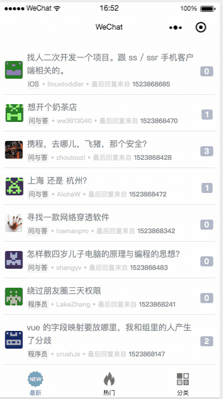

# wx-v2ex
仿照 v2ex 官网，写的微信小程序 v2ex。

## 说明

- 此项目作为学习练手，不涉及商业用途。
- 数据来源出自v2ex开发性 [api](https://www.v2ex.com/p/7v9TEc53)。

## 功能

- 最新主题、最热主题、主题分类模块
- 支持下拉刷新
- 支持 Tab 切换

## 使用

- clone 代码
- 下载**微信开发者工具**
- [微信开发设置](https://mp.weixin.qq.com/wxopen/devprofile)，在设置页面添加 **request 合法域名**

## 预览
  
  
  
## Licence
MIT
